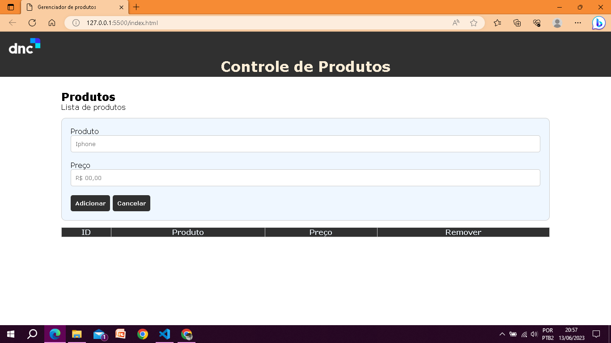
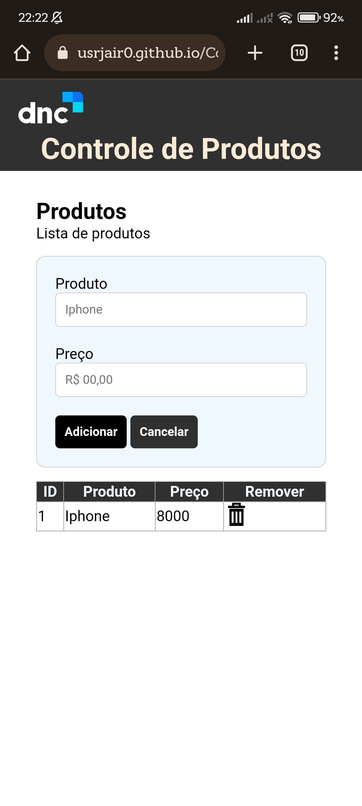

  <h1> Controle de produtos </h1>

#### Este projeto consiste em um controle de produtos.

## Tecnologias Utilizadas 
    Para fazer Esse projeto foram  utilizadas as seguintes tecnologias:
- HTML5;
- CSS3;
- Javascript.

## Instalação

1. Clone o repositório: `git clone https://github.com/usrjair0/multiplication_table.git`
2. Entre na pasta do projeto: `cd multiplication_table`
3. Instale as dependências: `npm install` 

## Uso 🧐

### A utilização é simples e bem intuitiva.  
podemos começar digitando o nome do produto e seu preço e logo em seguida clicar no botão de adicionar e o produto é adicionado na minha lista. Ao fazer isso meus inputs limpam e permitem que eu insira novamente um outro item. Temos também a opção de apagar o objeto adicionado, para fazer isso basta clicar no icone da lixeira. Além disso o botão cancelar limpa meus inputs.   
 Aqui temos uma imagem do projeto no computador 💻: 👇   
   
 e aqui no celular :iphone:: 👇   

## Contato

